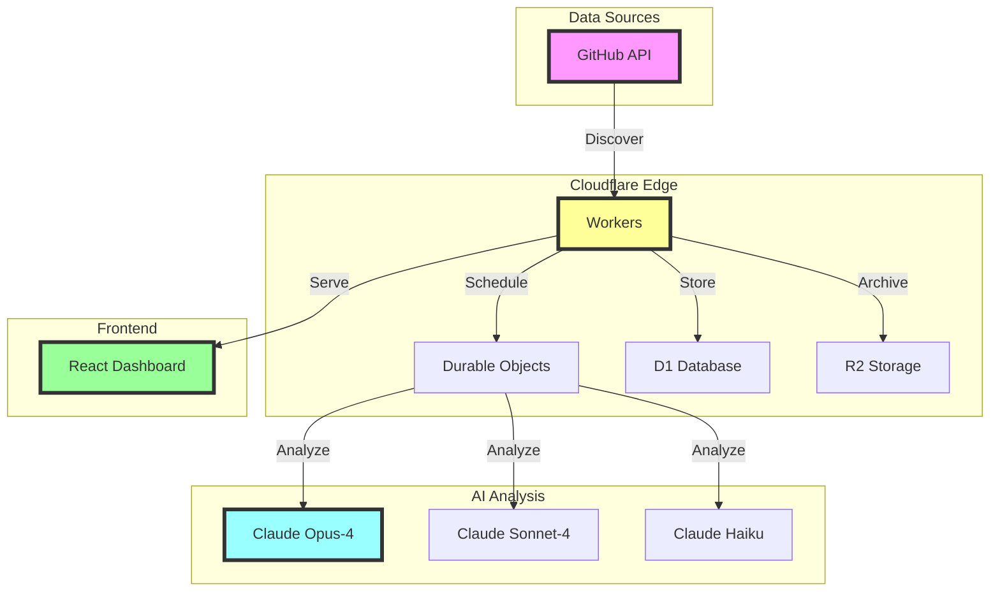
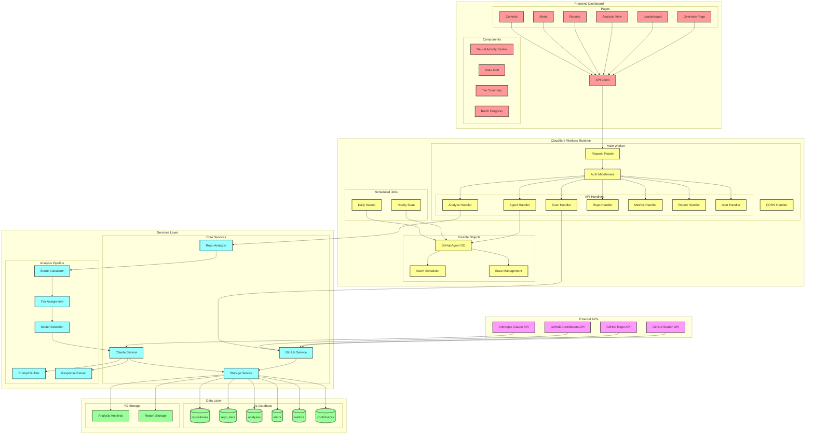
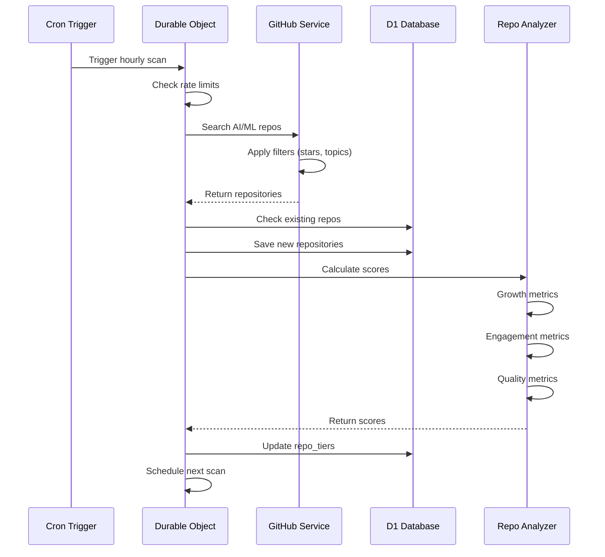
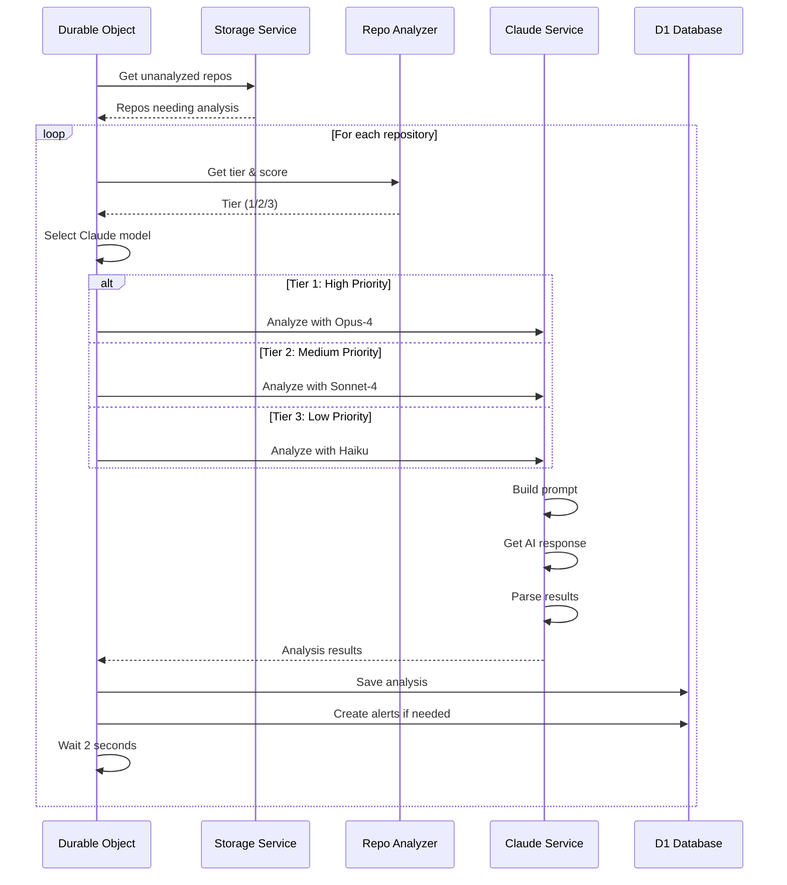
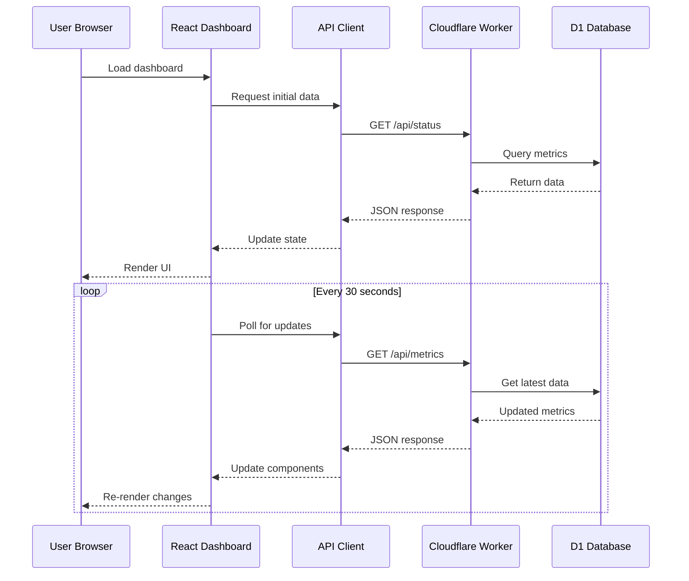
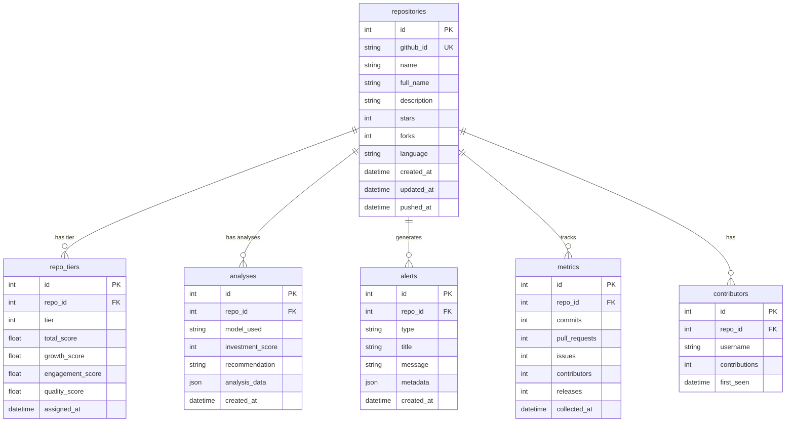

# 🚀 GitHub AI Intelligence Agent

<div align="center">
  
  [](https://github.com/nnkostov/cloudflare-agent-vibe-cline)
  [](LICENSE)
  [](https://workers.cloudflare.com)
  [](https://anthropic.com)
  
  **🤖 Your AI-Powered Venture Capital Analyst for GitHub**
  
  *Discover the next unicorn in AI/ML before everyone else does*

</div>

---

## 🎯 What is This?

Imagine having a tireless AI analyst that:
- 🔍 **Scans GitHub 24/7** for emerging AI/ML projects
- 🧠 **Analyzes with Claude AI** using VC-grade investment criteria
- 📊 **Tracks growth patterns** across thousands of repositories
- 🚨 **Alerts you instantly** when it finds high-potential opportunities
- 🎨 **Visualizes insights** in a stunning cyberpunk dashboard

**This is that analyst.** Built on Cloudflare Workers, powered by Claude AI, and designed for serious investors.

## ✨ Features That Make Us Special

<table>
<tr>
<td width="50%">

### 🧠 **AI-Powered Analysis**
- **Claude Opus-4** for deep research on high-potential projects
- **Claude Sonnet-4** for comprehensive standard analysis
- **Claude Haiku** for efficient quick scans
- Multi-factor scoring algorithm

</td>
<td width="50%">

### ⚡ **Real-Time Intelligence**
- Continuous GitHub monitoring
- Hourly batch analysis
- Smart tier-based prioritization
- Complete database coverage

</td>
</tr>
<tr>
<td width="50%">

### 🎮 **Cyberpunk Dashboard**
- Neural Activity Command Center
- Investment opportunity scoring
- Community health metrics
- Real-time system monitoring

</td>
<td width="50%">

### 📈 **Investment Insights**
- Growth trajectory predictions
- Technical moat assessment
- Team strength evaluation
- Market opportunity analysis

</td>
</tr>
</table>

## 🏗️ Architecture



## 🔧 Detailed System Architecture

### Complete Technical Architecture



### Data Flow Sequences

#### 🔍 Repository Discovery Flow



#### 🧠 Analysis Pipeline Flow



#### 📊 Dashboard Data Flow



### Database Schema



### Component Architecture

#### Worker Request Flow
```
┌─────────────────────────────────────────────────────────┐
│                   Incoming Request                       │
└────────────────────────┬────────────────────────────────┘
                         │
                         ▼
┌─────────────────────────────────────────────────────────┐
│                   CORS Handler                           │
│  • Set Access-Control headers                           │
│  • Handle preflight requests                            │
└────────────────────────┬────────────────────────────────┘
                         │
                         ▼
┌─────────────────────────────────────────────────────────┐
│                  Request Router                          │
│  • Parse URL path                                       │
│  • Match to handler                                     │
│  • Extract parameters                                   │
└────────────────────────┬────────────────────────────────┘
                         │
                         ▼
┌─────────────────────────────────────────────────────────┐
│                  API Handlers                            │
│  ┌─────────────┐  ┌─────────────┐  ┌─────────────┐    │
│  │Agent Handler│  │Scan Handler │  │Repo Handler │    │
│  └─────────────┘  └─────────────┘  └─────────────┘    │
│  ┌─────────────┐  ┌─────────────┐  ┌─────────────┐    │
│  │Alert Handler│  │Report Handler│  │Metrics Handler│   │
│  └─────────────┘  └─────────────┘  └─────────────┘    │
└────────────────────────┬────────────────────────────────┘
                         │
                         ▼
┌─────────────────────────────────────────────────────────┐
│                 Service Layer                            │
│  • Business logic                                       │
│  • Data validation                                      │
│  • External API calls                                   │
└────────────────────────┬────────────────────────────────┘
                         │
                         ▼
┌─────────────────────────────────────────────────────────┐
│                  Data Layer                              │
│  • D1 queries                                           │
│  • R2 operations                                        │
│  • Cache management                                     │
└─────────────────────────────────────────────────────────┘
```

### Security & Performance

#### Rate Limiting Strategy
- **GitHub API**: 5,000 requests/hour (authenticated)
- **Claude API**: Based on Anthropic plan limits
- **Internal throttling**: 2-second delay between analyses
- **Batch processing**: 25-50 repos per operation

#### Caching Architecture
- **D1 Cache**: 7-day analysis results
- **Worker Cache**: 5-minute API responses
- **Browser Cache**: Static assets with versioning
- **CDN Cache**: Cloudflare edge caching

#### Error Handling Flow
```
Try Operation
  ├─ Success → Return result
  └─ Error → Log to console
       ├─ Retry with backoff (3 attempts)
       ├─ Fallback to cached data
       └─ Return error response
```

## 🎯 How It Works

### 📊 Three-Tier Analysis System

```
┌─────────────────────────────────────────────────────────────┐
│ 🏆 TIER 1: PREMIUM ANALYSIS                                 │
├─────────────────────────────────────────────────────────────┤
│ ⭐ High-growth repositories with exceptional potential      │
│ 🤖 Analyzed by Claude Opus-4 for deep insights            │
│ ⏰ Scanned every few hours for latest updates              │
│ 📈 Includes technical moat & scalability assessment        │
└─────────────────────────────────────────────────────────────┘

┌─────────────────────────────────────────────────────────────┐
│ 🥈 TIER 2: STANDARD ANALYSIS                                │
├─────────────────────────────────────────────────────────────┤
│ ⭐ Established projects with steady growth                  │
│ 🤖 Analyzed by Claude Sonnet-4 for comprehensive review   │
│ ⏰ Scanned multiple times daily                            │
│ 📊 Full investment scoring and recommendations             │
└─────────────────────────────────────────────────────────────┘

┌─────────────────────────────────────────────────────────────┐
│ 🥉 TIER 3: DISCOVERY SCAN                                   │
├─────────────────────────────────────────────────────────────┤
│ ⭐ Emerging projects and hidden gems                       │
│ 🤖 Quickly assessed by Claude Haiku                       │
│ ⏰ Monitored regularly for breakout potential             │
│ 🔍 Efficient scanning to catch rising stars early         │
└─────────────────────────────────────────────────────────────┘
```

## 🚀 Quick Start

### Prerequisites
- Node.js 18+
- Cloudflare account
- GitHub token (for API access)
- Anthropic API key (for Claude AI)

### 1️⃣ Clone & Install

```bash
# Clone the repository
git clone https://github.com/nnkostov/cloudflare-agent-vibe-cline.git
cd cloudflare-agent-vibe-cline

# Install dependencies
npm install
cd dashboard && npm install && cd ..
```

### 2️⃣ Configure Environment

```bash
# Copy environment template
cp .env.example .env

# Edit .env with your credentials:
# - GITHUB_TOKEN
# - ANTHROPIC_API_KEY
```

### 3️⃣ Set Up Cloudflare Resources

```bash
# Create D1 database
wrangler d1 create github-agent-db

# Create R2 bucket  
wrangler r2 bucket create github-agent-storage

# Update wrangler.toml with the generated IDs
```

### 4️⃣ Initialize Database

```bash
# Run database migrations
wrangler d1 execute github-agent-db --file=./schema.sql
```

### 5️⃣ Deploy to Production

```bash
# Deploy the worker and dashboard
npm run deploy

# Your agent is now live! 🎉
```

### 6️⃣ Initialize the Agent

```bash
# Start automated scanning
curl -X POST https://your-worker.workers.dev/api/agent/init
```

## 🎮 Dashboard Preview

<div align="center">

### 🌟 Neural Activity Command Center
*Real-time system monitoring with cyberpunk aesthetics*

```
╔═══════════════════════════════════════════════════════════╗
║          🧠 NEURAL ACTIVITY COMMAND CENTER 🧠             ║
╠═══════════════════════════════════════════════════════════╣
║                                                           ║
║  ┌─────────────┐  ┌─────────────┐  ┌─────────────┐      ║
║  │ API NEXUS   │  │ ANALYSIS    │  │ QUEUE       │      ║
║  │ ████████░░  │  │ CORE        │  │ MATRIX      │      ║
║  │ 87% Active  │  │ ██████████  │  │ ████░░░░░░  │      ║
║  │             │  │ Processing  │  │ 42 Pending  │      ║
║  └─────────────┘  └─────────────┘  └─────────────┘      ║
║                                                           ║
╚═══════════════════════════════════════════════════════════╝
```

</div>

## 📡 API Endpoints

### Core Operations

| Endpoint | Method | Description |
|----------|--------|-------------|
| `/api/agent/init` | POST | Initialize automated scanning |
| `/api/status` | GET | System health and metrics |
| `/api/scan` | POST | Trigger manual repository scan |
| `/api/analyze` | POST | Analyze specific repository |

### Data Access

| Endpoint | Method | Description |
|----------|--------|-------------|
| `/api/repos/trending` | GET | Get trending repositories |
| `/api/repos/tier` | GET | Get repositories by tier |
| `/api/repos/count` | GET | Get repository statistics |
| `/api/metrics/comprehensive` | GET | Detailed repository metrics |

### Intelligence Reports

| Endpoint | Method | Description |
|----------|--------|-------------|
| `/api/reports/daily` | GET | Daily investment summary |
| `/api/reports/enhanced` | GET | Deep analysis reports |
| `/api/alerts` | GET | High-priority notifications |

## 🎯 Use Cases

### 🏦 For Venture Capitalists
> "Find the next AI unicorn before it hits mainstream"
- Automated deal flow for AI/ML investments
- Early detection of high-growth projects
- Comprehensive technical due diligence

### 👨‍💻 For Developers
> "Track the competition and emerging technologies"
- Monitor trending AI/ML libraries
- Discover new tools and frameworks
- Analyze successful project patterns

### 🔬 For Researchers
> "Stay ahead of AI/ML innovation curves"
- Track emerging research implementations
- Identify collaboration opportunities
- Monitor technology adoption trends

## 🛠️ Advanced Configuration

<details>
<summary><b>🔧 Environment Variables</b></summary>

```bash
# Required
GITHUB_TOKEN=            # GitHub personal access token
ANTHROPIC_API_KEY=       # Claude AI API key

# Optional
SCAN_INTERVAL=3600       # Scan frequency in seconds
ANALYSIS_BATCH_SIZE=25   # Repos per batch
TIER_1_THRESHOLD=100     # Minimum stars for Tier 1
```

</details>

<details>
<summary><b>📊 Scoring Algorithm</b></summary>

The system uses a weighted scoring algorithm:

```typescript
Total Score = (Growth × 0.4) + (Engagement × 0.3) + (Quality × 0.3)

Where:
- Growth: Stars, forks, contributor velocity
- Engagement: Issues, PRs, community activity  
- Quality: Documentation, tests, maintenance
```

</details>

<details>
<summary><b>🚀 Performance Tuning</b></summary>

- **Batch Processing**: Analyzes multiple repositories in parallel
- **Smart Caching**: 7-day cache for analyzed repositories
- **Rate Limiting**: Automatic throttling for API limits
- **Edge Computing**: Runs at Cloudflare edge locations globally

</details>

## 📈 Success Metrics

### 🏆 What Makes This Powerful

- **⚡ Speed**: From discovery to analysis in minutes, not days
- **🎯 Accuracy**: VC-grade analysis powered by Claude AI
- **📊 Coverage**: Comprehensive monitoring of the AI/ML ecosystem
- **🔄 Automation**: 24/7 operation without human intervention

### 💡 Real Impact

- **Time Saved**: Replaces hours of manual research
- **Opportunities Found**: Discovers projects before they trend
- **Insights Generated**: Deep technical and business analysis
- **Decisions Enabled**: Data-driven investment recommendations

## 🤝 Contributing

We welcome contributions! See our [Contributing Guide](CONTRIBUTING.md) for details.

### Development Setup

```bash
# Run locally
npm run dev

# Run tests
npm test

# Build dashboard
cd dashboard && npm run build
```

## 📚 Documentation

- [API Reference](docs/API.md)
- [Architecture Guide](docs/ARCHITECTURE.md)
- [Deployment Guide](docs/DEPLOYMENT.md)
- [Troubleshooting](docs/TROUBLESHOOTING.md)

## 🎉 Fun Facts

<div align="center">

### Did You Know? 🤔

- Our AI analyzes repositories faster than you can say "venture capital"
- The cyberpunk dashboard was inspired by Blade Runner and The Matrix
- We've discovered several projects that later became GitHub trending
- The system runs 24/7 and never needs coffee ☕

</div>

## 📜 License

MIT License - see [LICENSE](LICENSE) for details

---

<div align="center">

**Built with ❤️ by developers who believe AI should work for us**

[🌐 Live Demo](https://github-ai-intelligence.nkostov.workers.dev) | [📧 Contact](mailto:support@example.com) | [🐦 Twitter](https://twitter.com/example)

</div>
