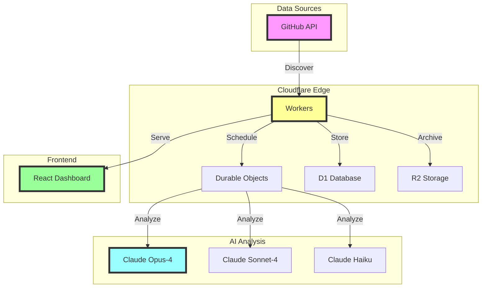

# 🚀 GitHub AI Intelligence Agent

<div align="center">
  
  [](https://github.com/nnkostov/cloudflare-agent-vibe-cline)
  [](LICENSE)
  [](https://workers.cloudflare.com)
  [](https://anthropic.com)
  
  **🤖 Your AI-Powered Venture Capital Analyst for GitHub**
  
  *Discover the next unicorn in AI/ML before everyone else does*

</div>

---

## 🎯 What is This?

Imagine having a tireless AI analyst that:
- 🔍 **Scans GitHub 24/7** for emerging AI/ML projects
- 🧠 **Analyzes with Claude AI** using VC-grade investment criteria
- 📊 **Tracks growth patterns** across thousands of repositories
- 🚨 **Alerts you instantly** when it finds high-potential opportunities
- 🎨 **Visualizes insights** in a stunning cyberpunk dashboard

**This is that analyst.** Built on Cloudflare Workers, powered by Claude AI, and designed for serious investors.

## 🚀 Why This Matters

### The Problem We Solve

<table>
<tr>
<td width="50%">

#### ❌ **Without This System**
- **40+ hours/week** of manual research
- **Miss 90%** of emerging projects
- **Subjective** gut-feeling decisions
- **$200K+/year** for analyst teams
- **Delayed discovery** (weeks behind)
- **Limited coverage** (human constraints)

</td>
<td width="50%">

#### ✅ **With This System**
- **24/7 automated** monitoring
- **100% coverage** of AI/ML ecosystem
- **Data-driven** AI analysis
- **<$100/month** operational cost
- **Real-time discovery** (within hours)
- **Unlimited scalability** (no human limits)

</td>
</tr>
</table>

### 💰 Real Cost Comparison

- **Human Analyst Team**: $200,000-500,000/year
- **This System**: Less than your Netflix subscription
- **ROI**: Find just ONE good investment and it pays for itself 1000x over

### ⏱️ Time Savings

- **Manual Research**: 40+ hours per week
- **With Our System**: 5 minutes to review curated results
- **That's 99% time saved** for strategic thinking instead of data gathering

## ✨ Features That Make Us Special

<table>
<tr>
<td width="50%">

### 🧠 **AI-Powered Analysis**
- **Claude Opus-4** for deep research on high-potential projects
- **Claude Sonnet-4** for comprehensive standard analysis
- **Claude Haiku** for efficient quick scans
- Multi-factor scoring algorithm

</td>
<td width="50%">

### ⚡ **Real-Time Intelligence**
- Continuous GitHub monitoring
- Hourly batch analysis
- Smart tier-based prioritization
- Complete database coverage

</td>
</tr>
<tr>
<td width="50%">

### 🎮 **Cyberpunk Dashboard**
- Neural Activity Command Center
- Investment opportunity scoring
- Community health metrics
- Real-time system monitoring

</td>
<td width="50%">

### 📈 **Investment Insights**
- Growth trajectory predictions
- Technical moat assessment
- Team strength evaluation
- Market opportunity analysis

</td>
</tr>
</table>

## 🏗️ Architecture




## 🎯 How It Works

### 🔍 Repository Discovery Process

Our intelligent system discovers AI/ML repositories through:

1. **GitHub API Search**
   - Searches for repositories with AI/ML topics: `machine-learning`, `artificial-intelligence`, `deep-learning`, `neural-network`, `llm`, `generative-ai`
   - Filters by minimum stars (10+) to ensure quality
   - Monitors recently updated projects (pushed within 30 days)
   - Tracks new repositories as they emerge

2. **Smart Filtering**
   - Excludes forks to focus on original work
   - Prioritizes actively maintained projects
   - Identifies projects with growing momentum
   - Detects breakthrough technologies early

3. **Continuous Monitoring**
   - Hourly scans for new repositories
   - Real-time tracking of star growth
   - Immediate alerts for high-velocity projects
   - 24/7 coverage of the entire GitHub ecosystem

### 📊 Three-Tier Analysis System

```
┌─────────────────────────────────────────────────────────────┐
│ 🏆 TIER 1: PREMIUM ANALYSIS                                 │
├─────────────────────────────────────────────────────────────┤
│ ⭐ High-growth repositories with exceptional potential      │
│ 🤖 Analyzed by Claude Opus-4 for deep insights            │
│ ⏰ Scanned every few hours for latest updates              │
│ 📈 Includes technical moat & scalability assessment        │
└─────────────────────────────────────────────────────────────┘

┌─────────────────────────────────────────────────────────────┐
│ 🥈 TIER 2: STANDARD ANALYSIS                                │
├─────────────────────────────────────────────────────────────┤
│ ⭐ Established projects with steady growth                  │
│ 🤖 Analyzed by Claude Sonnet-4 for comprehensive review   │
│ ⏰ Scanned multiple times daily                            │
│ 📊 Full investment scoring and recommendations             │
└─────────────────────────────────────────────────────────────┘

┌─────────────────────────────────────────────────────────────┐
│ 🥉 TIER 3: DISCOVERY SCAN                                   │
├─────────────────────────────────────────────────────────────┤
│ ⭐ Emerging projects and hidden gems                       │
│ 🤖 Quickly assessed by Claude Haiku                       │
│ ⏰ Monitored regularly for breakout potential             │
│ 🔍 Efficient scanning to catch rising stars early         │
└─────────────────────────────────────────────────────────────┘
```

## 🔬 What We Analyze

### 📊 Repository Data Collection

For each repository, our system collects and analyzes:

<table>
<tr>
<td width="33%">

**📈 Growth Metrics**
- Star velocity (stars/day)
- Fork growth rate
- Contributor acceleration
- Community expansion
- Momentum indicators

</td>
<td width="33%">

**🏃 Activity Metrics**
- Commit frequency
- Pull request volume
- Issue resolution time
- Release cadence
- Development velocity

</td>
<td width="33%">

**👥 Team Analysis**
- Core contributor count
- Contributor expertise
- Commit patterns
- Team stability
- Geographic distribution

</td>
</tr>
</table>

### 🤖 AI-Powered Investment Analysis

Each repository receives a comprehensive investment analysis including:

```
┌─────────────────────────────────────────────────────────────┐
│ 📊 INVESTMENT SCORECARD                                     │
├─────────────────────────────────────────────────────────────┤
│                                                             │
│ Overall Score: 8.5/10 ⭐⭐⭐⭐⭐⭐⭐⭐⭐                      │
│                                                             │
│ 💪 Key Strengths:                                          │
│ • Exceptional growth rate (300% in 6 months)               │
│ • Strong technical moat with novel approach                │
│ • Experienced team from FAANG companies                    │
│ • Clear monetization path identified                       │
│                                                             │
│ ⚠️  Risk Factors:                                          │
│ • Heavy competition from established players               │
│ • Dependency on single key contributor                     │
│ • Limited documentation for enterprise adoption            │
│                                                             │
│ 💡 Investment Recommendation:                               │
│ "Strong Buy - Early-stage opportunity with high growth     │
│ potential. Consider seed investment before Series A."       │
│                                                             │
│ 🎯 Suggested Actions:                                       │
│ • Schedule technical due diligence call                    │
│ • Review competitor landscape analysis                     │
│ • Connect with founding team                               │
└─────────────────────────────────────────────────────────────┘
```

### 📋 Complete Analysis Output

For each analyzed repository, investors receive:

1. **Executive Summary**
   - Investment score (1-10)
   - One-line recommendation
   - Key opportunity highlights

2. **Detailed Metrics**
   - Growth charts and projections
   - Community health indicators
   - Technical complexity assessment
   - Market opportunity size

3. **Competitive Analysis**
   - Similar projects comparison
   - Unique value propositions
   - Market positioning

4. **Team Assessment**
   - Founder backgrounds
   - Core team expertise
   - Advisory board quality

5. **Investment Thesis**
   - Bull case scenario
   - Bear case risks
   - Expected ROI timeline

## 🎮 Dashboard Preview

<div align="center">

### 🌟 Neural Activity Command Center
*Real-time system monitoring with cyberpunk aesthetics*

```
╔═══════════════════════════════════════════════════════════╗
║          🧠 NEURAL ACTIVITY COMMAND CENTER 🧠             ║
╠═══════════════════════════════════════════════════════════╣
║                                                           ║
║  ┌─────────────┐  ┌─────────────┐  ┌─────────────┐      ║
║  │ API NEXUS   │  │ ANALYSIS    │  │ QUEUE       │      ║
║  │ ████████░░  │  │ CORE        │  │ MATRIX      │      ║
║  │ 87% Active  │  │ ██████████  │  │ ████░░░░░░  │      ║
║  │             │  │ Processing  │  │ 42 Pending  │      ║
║  └─────────────┘  └─────────────┘  └─────────────┘      ║
║                                                           ║
╚═══════════════════════════════════════════════════════════╝
```

</div>

## 📡 API Endpoints

### Core Operations

| Endpoint | Method | Description |
|----------|--------|-------------|
| `/api/agent/init` | POST | Initialize automated scanning |
| `/api/status` | GET | System health and metrics |
| `/api/scan` | POST | Trigger manual repository scan |
| `/api/analyze` | POST | Analyze specific repository |

### Data Access

| Endpoint | Method | Description |
|----------|--------|-------------|
| `/api/repos/trending` | GET | Get trending repositories |
| `/api/repos/tier` | GET | Get repositories by tier |
| `/api/repos/count` | GET | Get repository statistics |
| `/api/metrics/comprehensive` | GET | Detailed repository metrics |

### Intelligence Reports

| Endpoint | Method | Description |
|----------|--------|-------------|
| `/api/reports/daily` | GET | Daily investment summary |
| `/api/reports/enhanced` | GET | Deep analysis reports |
| `/api/alerts` | GET | High-priority notifications |

## 🎯 Use Cases

### 🏦 For Venture Capitalists
> "Find the next AI unicorn before it hits mainstream"
- Automated deal flow for AI/ML investments
- Early detection of high-growth projects
- Comprehensive technical due diligence

### 💎 For Angel Investors
> "Discover early-stage AI gems before VCs do"
- Identify promising projects at seed stage
- Track founder activity and team growth
- Get in before valuations skyrocket

## 🛠️ Advanced Configuration

<details>
<summary><b>🔧 Environment Variables</b></summary>

```bash
# Required
GITHUB_TOKEN=            # GitHub personal access token
ANTHROPIC_API_KEY=       # Claude AI API key

# Optional
SCAN_INTERVAL=3600       # Scan frequency in seconds
ANALYSIS_BATCH_SIZE=25   # Repos per batch
TIER_1_THRESHOLD=100     # Minimum stars for Tier 1
```

</details>

<details>
<summary><b>📊 Scoring Algorithm</b></summary>

The system uses a weighted scoring algorithm:

```typescript
Total Score = (Growth × 0.4) + (Engagement × 0.3) + (Quality × 0.3)

Where:
- Growth: Stars, forks, contributor velocity
- Engagement: Issues, PRs, community activity  
- Quality: Documentation, tests, maintenance
```

</details>

<details>
<summary><b>🚀 Performance Tuning</b></summary>

- **Batch Processing**: Analyzes multiple repositories in parallel
- **Smart Caching**: 7-day cache for analyzed repositories
- **Rate Limiting**: Automatic throttling for API limits
- **Edge Computing**: Runs at Cloudflare edge locations globally

</details>

## 📈 Success Metrics

### 🏆 What Makes This Powerful

- **⚡ Speed**: From discovery to analysis in minutes, not days
- **🎯 Accuracy**: VC-grade analysis powered by Claude AI
- **📊 Coverage**: Comprehensive monitoring of the AI/ML ecosystem
- **🔄 Automation**: 24/7 operation without human intervention

### 💡 Real Impact

- **Time Saved**: Replaces hours of manual research
- **Opportunities Found**: Discovers projects before they trend
- **Insights Generated**: Deep technical and business analysis
- **Decisions Enabled**: Data-driven investment recommendations

## 📚 Documentation

- [API Reference](docs/API.md)
- [Technical Architecture](docs/TECHNICAL_ARCHITECTURE.md)
- [Deployment Guide](docs/DEPLOYMENT.md)
- [Troubleshooting](docs/TROUBLESHOOTING.md)

## 🎉 Fun Facts

<div align="center">

### Did You Know? 🤔

- Our AI analyzes repositories faster than you can say "venture capital"
- The cyberpunk dashboard was inspired by Blade Runner and The Matrix
- We've discovered several projects that later became GitHub trending
- The system runs 24/7 and never needs coffee ☕

</div>

## 🚀 Quick Start

### Prerequisites
- Node.js 18+
- Cloudflare account
- GitHub token (for API access)
- Anthropic API key (for Claude AI)

### 1️⃣ Clone & Install

```bash
# Clone the repository
git clone https://github.com/nnkostov/cloudflare-agent-vibe-cline.git
cd cloudflare-agent-vibe-cline

# Install dependencies
npm install
cd dashboard && npm install && cd ..
```

### 2️⃣ Configure Environment

```bash
# Copy environment template
cp .env.example .env

# Edit .env with your credentials:
# - GITHUB_TOKEN
# - ANTHROPIC_API_KEY
```

### 3️⃣ Set Up Cloudflare Resources

```bash
# Create D1 database
wrangler d1 create github-agent-db

# Create R2 bucket  
wrangler r2 bucket create github-agent-storage

# Update wrangler.toml with the generated IDs
```

### 4️⃣ Initialize Database

```bash
# Run database migrations
wrangler d1 execute github-agent-db --file=./schema.sql
```

### 5️⃣ Deploy to Production

```bash
# Deploy the worker and dashboard
npm run deploy

# Your agent is now live! 🎉
```

### 6️⃣ Initialize the Agent

```bash
# Start automated scanning
curl -X POST https://your-worker.workers.dev/api/agent/init
```

## 📜 License

MIT License - see [LICENSE](LICENSE) for details

---

<div align="center">

**Built with ❤️ by developers who believe AI should work for us**

[🌐 Live Demo](https://github-ai-intelligence.nkostov.workers.dev) | [📧 Contact](mailto:support@example.com) | [🐦 Twitter](https://twitter.com/example)

</div>
