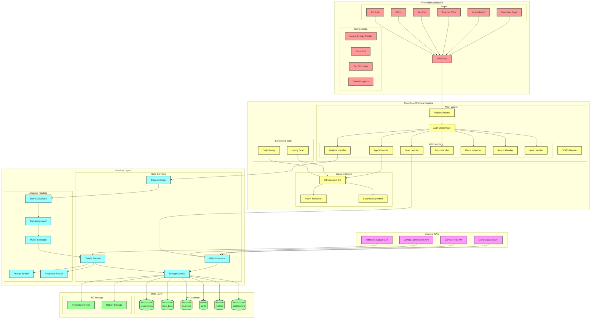
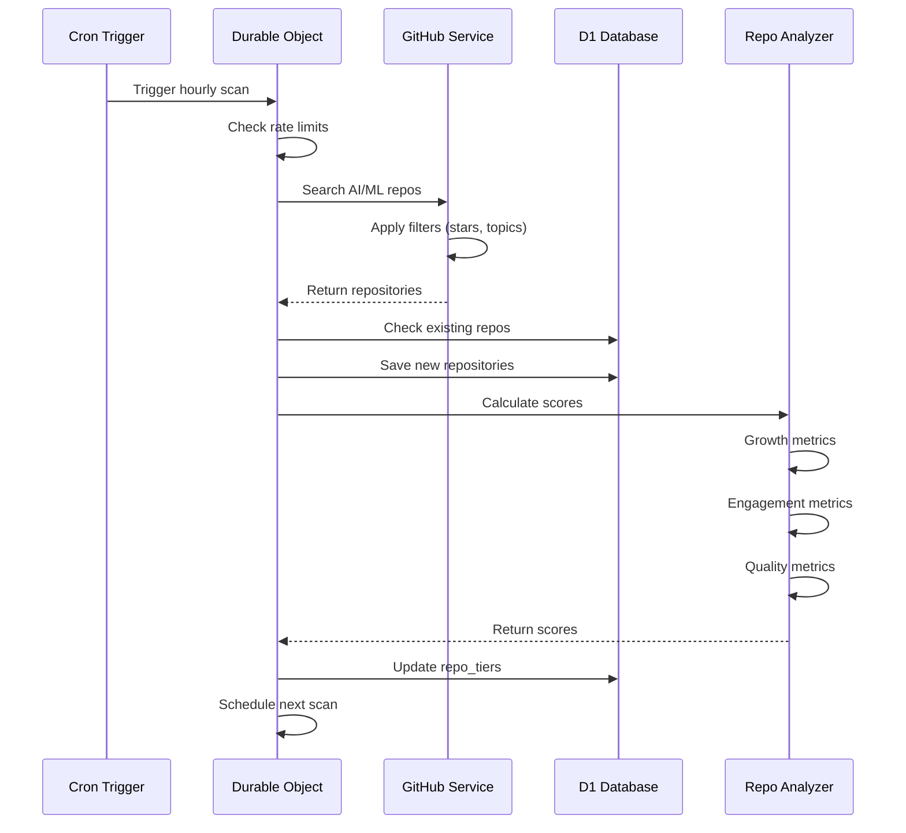
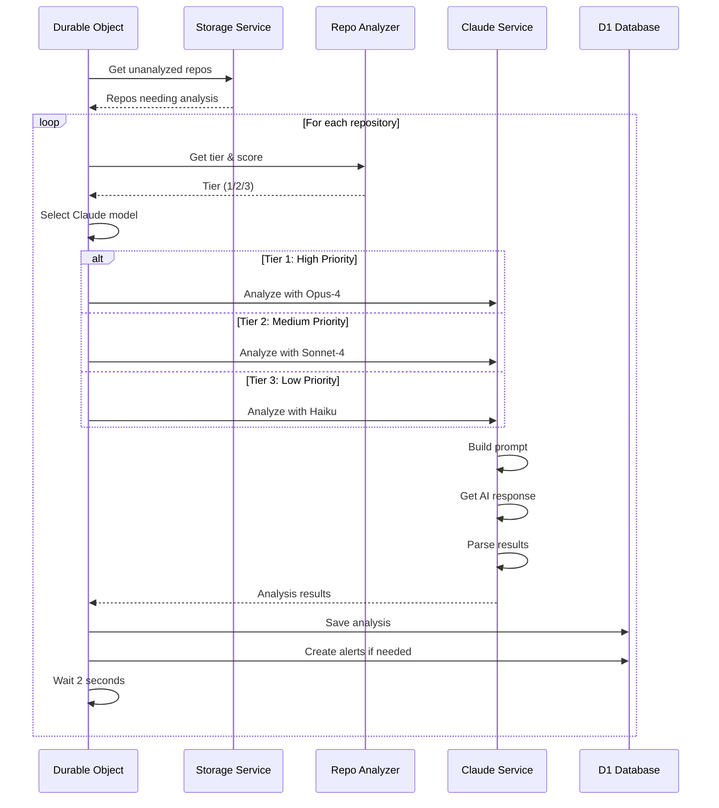
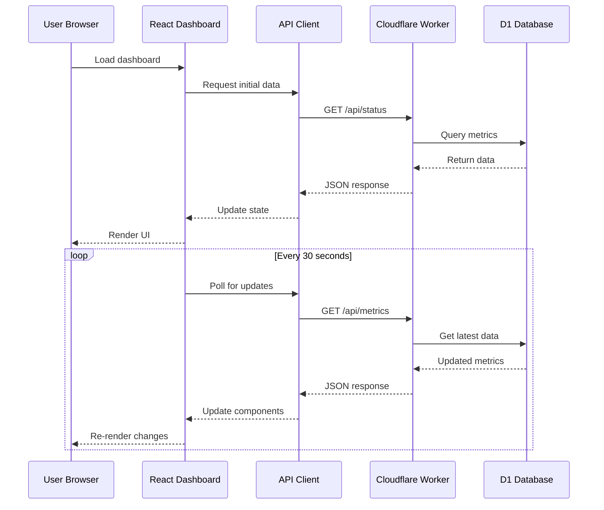
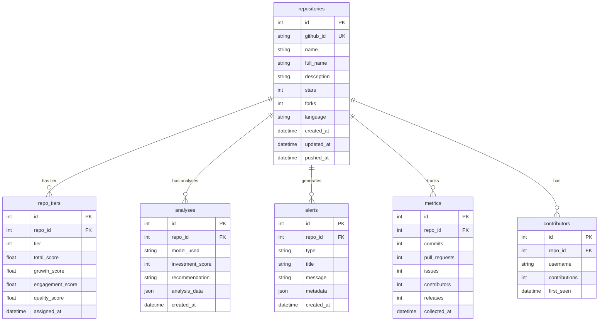

# 🔧 Technical Architecture Documentation

This document contains the detailed technical architecture of the GitHub AI Intelligence Agent system.

## Table of Contents
- [Complete System Architecture](#complete-system-architecture)
- [Data Flow Sequences](#data-flow-sequences)
- [Database Schema](#database-schema)
- [Component Architecture](#component-architecture)
- [Security & Performance](#security--performance)
- [API Reference](#api-reference)

## Complete System Architecture



## Data Flow Sequences

### 🔍 Repository Discovery Flow



### 🧠 Analysis Pipeline Flow



### 📊 Dashboard Data Flow



## Database Schema



## Component Architecture

### Worker Request Flow
```
┌─────────────────────────────────────────────────────────┐
│                   Incoming Request                       │
└────────────────────────┬────────────────────────────────┘
                         │
                         ▼
┌─────────────────────────────────────────────────────────┐
│                   CORS Handler                           │
│  • Set Access-Control headers                           │
│  • Handle preflight requests                            │
└────────────────────────┬────────────────────────────────┘
                         │
                         ▼
┌─────────────────────────────────────────────────────────┐
│                  Request Router                          │
│  • Parse URL path                                       │
│  • Match to handler                                     │
│  • Extract parameters                                   │
└────────────────────────┬────────────────────────────────┘
                         │
                         ▼
┌─────────────────────────────────────────────────────────┐
│                  API Handlers                            │
│  ┌─────────────┐  ┌─────────────┐  ┌─────────────┐    │
│  │Agent Handler│  │Scan Handler │  │Repo Handler │    │
│  └─────────────┘  └─────────────┘  └─────────────┘    │
│  ┌─────────────┐  ┌─────────────┐  ┌─────────────┐    │
│  │Alert Handler│  │Report Handler│  │Metrics Handler│   │
│  └─────────────┘  └─────────────┘  └─────────────┘    │
└────────────────────────┬────────────────────────────────┘
                         │
                         ▼
┌─────────────────────────────────────────────────────────┐
│                 Service Layer                            │
│  • Business logic                                       │
│  • Data validation                                      │
│  • External API calls                                   │
└────────────────────────┬────────────────────────────────┘
                         │
                         ▼
┌─────────────────────────────────────────────────────────┐
│                  Data Layer                              │
│  • D1 queries                                           │
│  • R2 operations                                        │
│  • Cache management                                     │
└─────────────────────────────────────────────────────────┘
```

### Service Architecture

#### GitHub Service
- **Purpose**: Interface with GitHub API
- **Key Methods**:
  - `searchRepositories()`: Find AI/ML repos
  - `getRepository()`: Get detailed repo info
  - `getContributors()`: Fetch contributor data
  - `getMetrics()`: Collect commits, PRs, issues
- **Rate Limiting**: 5,000 requests/hour

#### Claude Service
- **Purpose**: AI analysis using Anthropic Claude
- **Key Methods**:
  - `analyzeRepository()`: Main analysis entry point
  - `buildPrompt()`: Construct analysis prompt
  - `parseResponse()`: Extract structured data
- **Model Selection**:
  - Tier 1 → Claude Opus-4
  - Tier 2 → Claude Sonnet-4
  - Tier 3 → Claude Haiku

#### Storage Service
- **Purpose**: Database operations
- **Key Methods**:
  - `saveRepository()`: Store repo data
  - `updateTier()`: Assign/update tiers
  - `saveAnalysis()`: Store AI analysis
  - `createAlert()`: Generate notifications
- **Optimizations**:
  - Batch operations
  - Connection pooling
  - Query optimization

#### Repo Analyzer
- **Purpose**: Score and tier calculation
- **Scoring Formula**:
  ```
  Total = (Growth × 0.4) + (Engagement × 0.3) + (Quality × 0.3)
  ```
- **Tier Assignment**:
  - Tier 1: Score ≥ 70 OR (stars ≥ 100 AND growth > 10%)
  - Tier 2: Score ≥ 50 OR stars ≥ 50
  - Tier 3: All others

## Security & Performance

### Rate Limiting Strategy
- **GitHub API**: 5,000 requests/hour (authenticated)
- **Claude API**: Based on Anthropic plan limits
- **Internal throttling**: 2-second delay between analyses
- **Batch processing**: 25-50 repos per operation

### Caching Architecture
- **D1 Cache**: 7-day analysis results
- **Worker Cache**: 5-minute API responses
- **Browser Cache**: Static assets with versioning
- **CDN Cache**: Cloudflare edge caching

### Error Handling Flow
```
Try Operation
  ├─ Success → Return result
  └─ Error → Log to console
       ├─ Retry with backoff (3 attempts)
       ├─ Fallback to cached data
       └─ Return error response
```

### Security Measures
- **API Keys**: Stored as Cloudflare secrets
- **CORS**: Configured for dashboard origin
- **Input Validation**: All user inputs sanitized
- **SQL Injection**: Prepared statements only
- **Rate Limiting**: Per-IP request throttling

### Performance Optimizations
- **Edge Computing**: Runs at 200+ Cloudflare locations
- **Streaming Responses**: For large datasets
- **Lazy Loading**: Dashboard components
- **Database Indexes**: On frequently queried columns
- **Connection Pooling**: Reuse database connections

## API Reference

### Authentication
All API requests require proper CORS headers. API keys are managed server-side.

### Endpoints

#### System Management
- `POST /api/agent/init` - Initialize the agent
- `GET /api/status` - System health check
- `POST /api/scan` - Manual repository scan
- `POST /api/analyze` - Analyze specific repo

#### Data Access
- `GET /api/repos/trending` - Trending repositories
- `GET /api/repos/tier?tier={1|2|3}` - Repos by tier
- `GET /api/repos/count` - Repository statistics
- `GET /api/metrics/comprehensive?repo_id={id}` - Detailed metrics

#### Reports & Alerts
- `GET /api/reports/daily` - Daily summary
- `GET /api/reports/enhanced` - Deep analysis
- `GET /api/alerts` - Recent notifications

### Response Format
```json
{
  "success": true,
  "data": { ... },
  "error": null,
  "timestamp": "2025-01-21T12:00:00Z"
}
```

### Error Codes
- `400` - Bad Request
- `401` - Unauthorized
- `404` - Not Found
- `429` - Rate Limited
- `500` - Internal Error

## Deployment Architecture

### Cloudflare Resources
- **Workers**: Edge compute runtime
- **Durable Objects**: Stateful coordination
- **D1**: SQL database
- **R2**: Object storage
- **KV**: Key-value cache (optional)

### Environment Variables
```bash
GITHUB_TOKEN=          # Required
ANTHROPIC_API_KEY=     # Required
WORKER_ENV=            # production/development
```

### Deployment Process
1. Build dashboard: `cd dashboard && npm run build`
2. Deploy worker: `wrangler deploy`
3. Initialize database: `wrangler d1 execute`
4. Start agent: `POST /api/agent/init`

## Monitoring & Debugging

### Logging
- Console logs visible in Cloudflare dashboard
- Structured logging with levels
- Request/response tracking
- Error stack traces

### Metrics
- Request count and latency
- API rate limit usage
- Database query performance
- Cache hit rates

### Debugging Tools
- Cloudflare Workers dashboard
- Wrangler tail for live logs
- D1 query console
- Browser DevTools for frontend

---

For more information, see the main [README](../README.md) or contact the development team.
